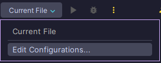
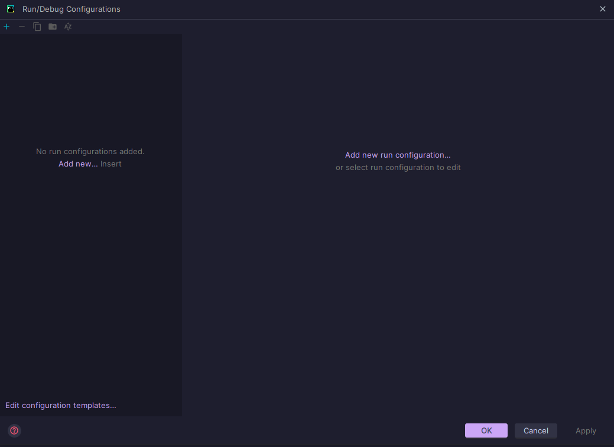
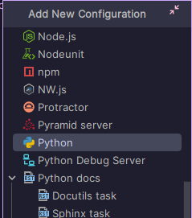
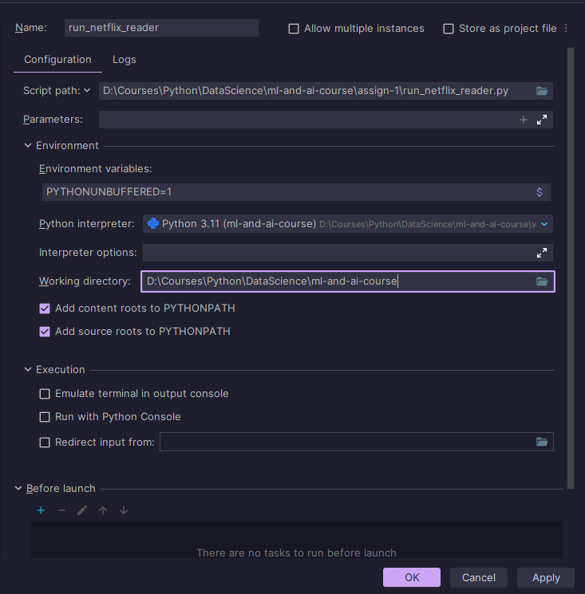

# ml-and-ai-course
Repository for all projects done during the course.

### IMPORTANT
Add **new configuration** in **PyCharm** to set the correct working directory.
Otherwise, the paths in `run_netflix_reader.py` need to be changed.

#### New paths should be as follows:

`run_netflix_reader.py`:  
... 
~~`reader.read_netflix_data(file_path="assign-1/data/netflix_data.csv")`~~  
`reader.read_netflix_data(file_path="data/netflix_data.csv")`  
...  
~~`reader.write_netflix_data("assign-1/output_data")`~~  
`reader.write_netflix_data("output_data")`

## Adding new configuration
### 1. Open config selector - click *Edit Configurations...* 

### 2. Click on + or *Add new...* 

### 3. Select *Python* 

### 4. Pay attention to *Script path* and *Working directory*: 
